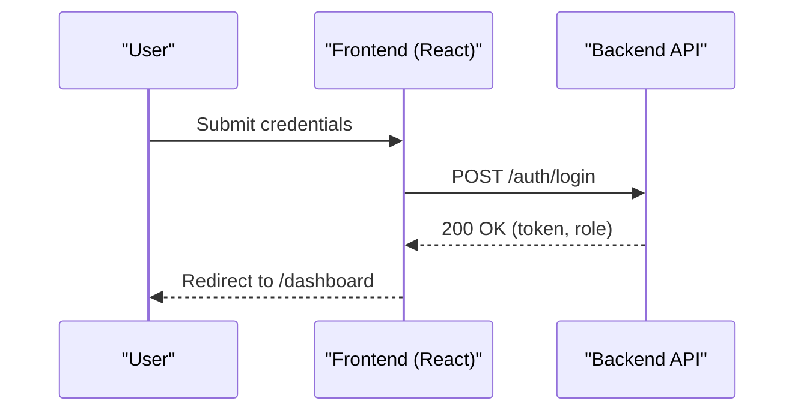
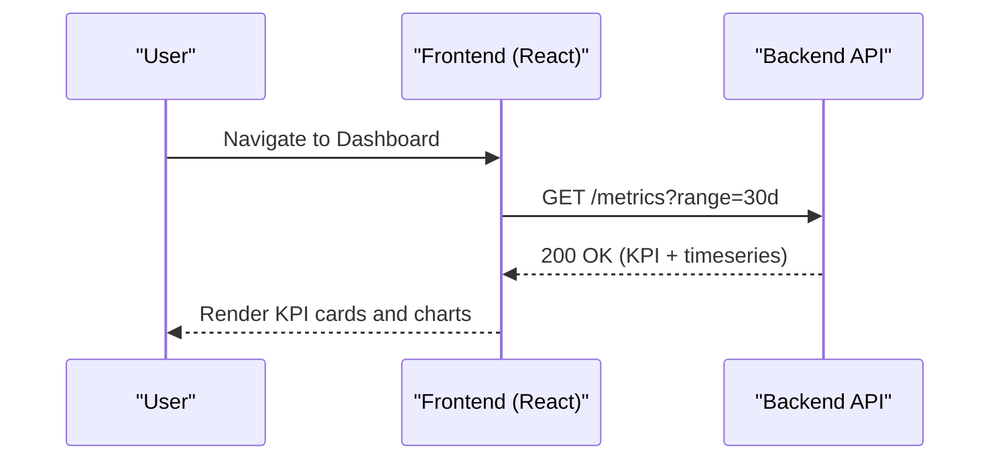
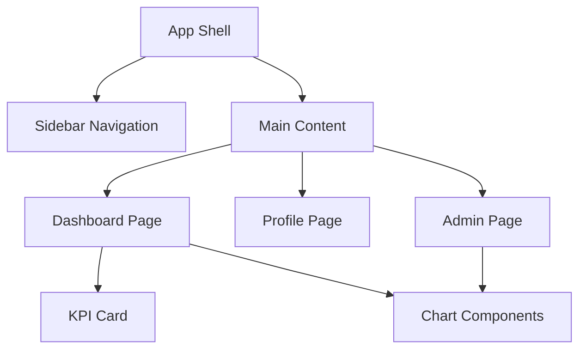

# Architecture — Admin Dashboard Suite (React Frontend)

## Overview
This document describes the architecture of the React-based Admin Dashboard Suite frontend. The application is a single-page app (SPA) that communicates with a backend REST API and optionally a WebSocket endpoint to render analytics, manage user profiles, and present an admin analytics overview for privileged users. The UI follows a sidebar layout with a main content area and uses a light theme with a modern, minimalistic style.

## High-Level Architecture
- Client: React SPA running in the browser.
- API Integration: REST over HTTPS for authentication, analytics, and profile operations. Optional WebSocket for live updates.
- State Management: Component-local state for UI and lightweight global state using React Context or a small state library (to be finalized).
- Routing: Client-side routing for Login, Dashboard, Profile, and Admin routes with role-based guards.
- Visualization: Charting library integrated via lazy-loaded components to minimize bundle size.
- Theming: CSS variables or a design system setup to align with the specified theme.

## Environment and Configuration
- Environment variables used by the frontend:
  - REACT_APP_API_BASE
  - REACT_APP_BACKEND_URL
  - REACT_APP_FRONTEND_URL
  - REACT_APP_WS_URL
  - REACT_APP_NODE_ENV
  - REACT_APP_NEXT_TELEMETRY_DISABLED
  - REACT_APP_ENABLE_SOURCE_MAPS
  - REACT_APP_PORT
  - REACT_APP_TRUST_PROXY
  - REACT_APP_LOG_LEVEL
  - REACT_APP_HEALTHCHECK_PATH
  - REACT_APP_FEATURE_FLAGS
  - REACT_APP_EXPERIMENTS_ENABLED
- Configuration is injected at build time and read via process.env variables in the frontend build system.
- Feature flags allow toggling experimental features and A/B tests without redeploying.

## Component Structure
- App Shell
  - Sidebar: Navigation items (Dashboard, Profile, Admin for admins only).
  - Header/Toolbar: Optional user menu, theme selector (future), notifications.
  - Main Content: Routed view container.
- Pages
  - Login: Authentication page; redirects on success.
  - Dashboard: KPI cards and charts for posts, followers, engagement.
  - Profile: Profile view/edit form.
  - Admin: Admin-only analytics overview.
- Shared Components
  - KPI Card: Standardized metric display component.
  - Chart Components: Lazy-loaded wrappers for charts (LineChart, BarChart, PieChart).
  - Forms: Input components with validation and consistent styling.
  - Layout Utilities: Grid, spacing, and responsive containers.
- Hooks/Utilities
  - useAuth: Manages token, user, and role; exposes login/logout.
  - useApi: Fetch helper that injects auth headers and handles errors.
  - useFeatureFlags: Reads enabled features/experiments from environment.
  - useResponsive: Determines breakpoints and adjusts layout behavior.

## Data Flow
- Authentication Flow
  - Login page posts credentials to the backend (REACT_APP_BACKEND_URL or REACT_APP_API_BASE).
  - On success, token is stored (e.g., httpOnly cookie or secure storage pattern), and auth context updates user state.
  - Protected routes check auth context to allow or redirect.
- Analytics Flow
  - Dashboard and Admin pages request metrics from the backend.
  - Responses populate KPI cards and chart components.
  - Filters (e.g., date range) are applied to subsequent requests.
  - Optional WebSocket connection (REACT_APP_WS_URL) streams live updates; fallback to polling when unavailable.
- Profile Flow
  - Profile page fetches user profile details on mount.
  - Edits are submitted via PUT/PATCH; success updates state and refreshes the view.

## Security Considerations
- Always use HTTPS endpoints.
- Avoid storing tokens in localStorage when possible; use httpOnly cookies if backend supports it. If stored in memory or secure storage, protect against XSS via strict Content Security Policy and thorough input sanitization.
- Role-based access checks on the client complement server-side authorization but do not replace it.
- Do not include secrets in client bundles; only public configuration via REACT_APP_ variables.

## Theming and Styling
- Theme: light, modern, minimalistic.
- Colors:
  - Primary: #3B82F6
  - Accent: #F59E0B
  - Secondary: #10B981
  - Error: #EF4444
  - Background: #f9fafb
  - Surface: #ffffff
  - Text: #111827
- Implement theme via CSS variables or a theme provider to ensure consistency across components.
- Follow accessible color contrast and spacing guidelines.

## Routing and Access Control
- Public Routes:
  - /login
- Protected Routes (Authenticated):
  - /dashboard
  - /profile
- Admin Route (Authenticated + Admin role):
  - /admin
- Route Guards:
  - Check auth context and role before rendering protected routes; redirect unauthorized users to /login.

## Error Handling and Observability
- Global error boundary to capture runtime exceptions.
- API errors surfaced via toasts/alerts with retry options.
- Client-side logging routed based on REACT_APP_LOG_LEVEL.
- Health check page or endpoint path defined via REACT_APP_HEALTHCHECK_PATH can be polled by infrastructure.

## Performance
- Code Splitting:
  - Lazy-load charts and admin route to reduce initial bundle size.
- Caching:
  - Use HTTP caching headers where possible and client-side memoization for repeated queries.
- Images and Assets:
  - Optimize avatar uploads and compress images.

## Build and Deployment
- Build:
  - Environment variables injected at build time.
  - Source maps controlled by REACT_APP_ENABLE_SOURCE_MAPS.
- Deployment:
  - Serve over HTTPS (port 443).
  - Trust proxy settings via REACT_APP_TRUST_PROXY where applicable.
- Telemetry:
  - REACT_APP_NEXT_TELEMETRY_DISABLED can disable framework telemetry if not required.

## Sequence Diagrams

### Authentication Sequence

### Dashboard Data Fetch

## Component Interaction Diagram

## Future Extensions
- Notifications center with real-time updates.
- Multi-tenant theme variations.
- Admin user management actions (role assignment, suspensions).
- Offline caching for recent analytics snapshots.
